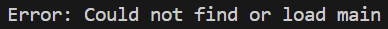
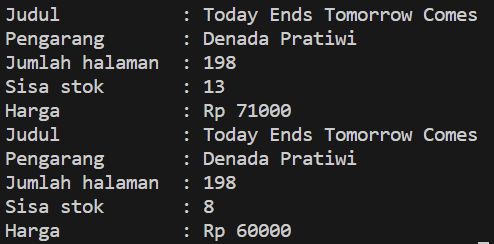
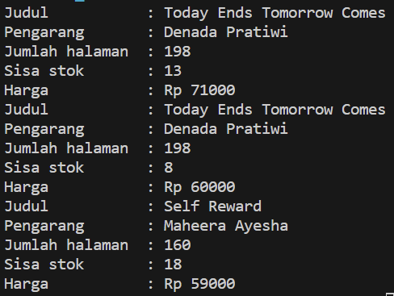
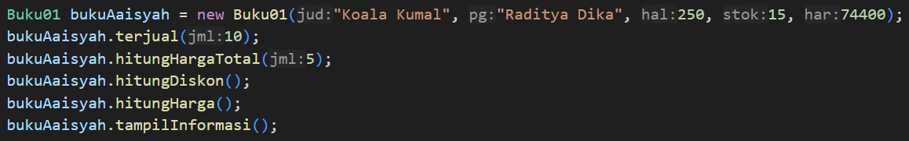
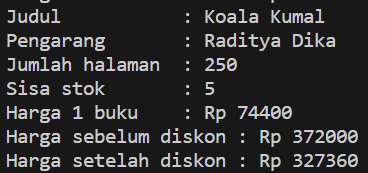
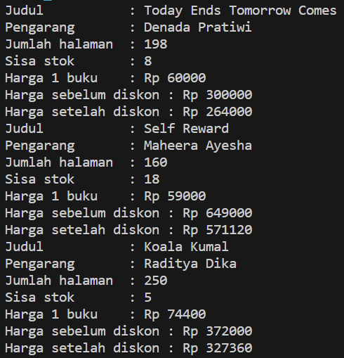
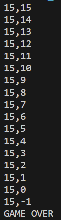

# Laporan Praktikum Pertemuan 2
Nama            : Aaisyah Nursalsabiil 
NIM             : 2341720171
Kelas / absen   : 1H - TI / 01
## 2.1 Percobaan 1

### 2.1.3 Pertanyaan

1.  * Memiliki suatu data/karakter/properti yang biasa disebut dengan atribut

    * Dapat melakukan suatu tingkah laku atau biasa disebut method

2. Terdapat 5 atribut. yaitu judul, pengarang, halaman, stok, harga.

3. Terdapat 4 method. yaitu tampilInformasi, terjual, restock, gantiHarga.

4. void terjual(int jml){
        if (stok > 0){
        stok -= jml;
        }
    }

5. Karena tipe data yang dibutuhkan adalah untuk bilangan bulat.

## Percobaan 2

### 2.2.3 Pertanyaan

1.  * Instansiasi : Buku01 bk1 = new Buku01();
    
    * Nama object yang dihasilkan : bk1

2. Cara untuk mengakses atribut dan method dari suatu objek yaitu dengan mengetikkan object.atribut = .. ;

    misal : bk1.judul = "Today Ends Tomorrow Comes";

3. Hasil output pemanggilan method tampilInformasi() pertama dan kedua berbeda karena terdapat perubahan jumlah buku terjual dan perubahan harga.

## Percobaan 3

### 2.3.3 Pertanyaan

1.  public Buku01(String jud, String pg, int hal, int stok, int har){
        judul = jud;
        pengarang = pg;
        halaman = hal;
        this.stok = stok;
        harga = har;
    }

2. Proses tersebut merupakan instansiasi

3. 

    Hasilnya error, karena instansiasi pada class BukuMain tidak memiliki definisi dari konstruktornya yaitu Buku();

4. 
    Tidak. Method dalam class Buku bisa dipanggil meskipun tidak berurutan
5. 

## Latihan Praktikum
1. 

2. 

