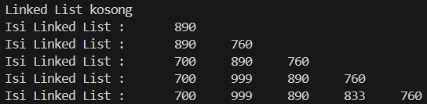
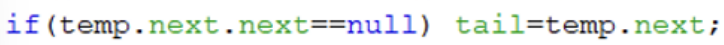
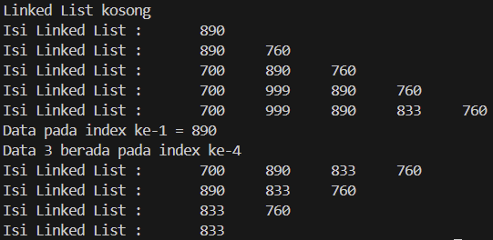

# Laporan Praktikum Pertemuan 11
Nama          : Aaisyah Nursalsabiil

NIM           : 2341720171

Kelas / absen : 1H - TI / 01

## 2.1 Pembuatan Single Linked List

### 2.1.2 Pertanyaan
1. Mengapa hasil compile kode program di baris pertama menghasilkan “Linked List Kosong”?
2. Jelaskan kegunaan variable temp secara umum pada setiap method!
3. Perhatikan class SingleLinkedList, pada method insertAt Jelaskan kegunaan kode berikut

## 2.2 Modifikasi Elemen pada Single Linked List

### 2.2.3 Pertanyaan
1. Mengapa digunakan keyword break pada fungsi remove? Jelaskan!
2. Jelaskan kegunaan kode dibawah pada method remove
