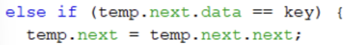

# Laporan Praktikum Pertemuan 11
Nama          : Aaisyah Nursalsabiil

NIM           : 2341720171

Kelas / absen : 1H - TI / 01

## 2.1 Pembuatan Single Linked List

### 2.1.2 Pertanyaan
1. Mengapa hasil compile kode program di baris pertama menghasilkan “Linked List Kosong”?
Jawab : 
Karena hal pertama yang harus dilakukan adalah menampilkan isi dari penyimpanan sehingga ketika tidak ada isi akan menampilkan "Linked list kosong"

2. Jelaskan kegunaan variable temp secara umum pada setiap method!
Jawab : 
Digunakan untuk menyimpan data dari salah satu penyimpanan untuk dilakukan perpindahan node

3. Perhatikan class SingleLinkedList, pada method insertAt Jelaskan kegunaan kode berikut

Jawab : 
Kode diatas digunakan untuk memastikan node yang akan ditambahkan merupakan node terakhir, jika iya maka data akan diubah menjadi tail

## 2.2 Modifikasi Elemen pada Single Linked List

### 2.2.3 Pertanyaan
1. Mengapa digunakan keyword break pada fungsi remove? Jelaskan!
Jawab : 
Break digunakan untuk berhenti melakukan looping setelah kondisi tertentu terprnuhi

2. Jelaskan kegunaan kode dibawah pada method remove

Jawab :
Kode diatas digunakan dalam keadaan data selanjutnya merupakan key yang akan dihapus sehingga data tersebut akan ditimpa dengan data setelah key tersebut.

## Tugas
1. Implementasikan ilustrasi Linked List Berikut. Gunakan 4 macam penambahan data yang telah dipelajari sebelumnya untuk menginputkan data.

2. Buatlah implementasi program antrian layanan unit kemahasiswaan sesuai dengan kondisi yang ditunjukkan pada soal nomor 1! Ketentuan
    a. Implementasi antrian menggunakan Queue berbasis Linked List!
    b. Program merupakan proyek baru, bukan modifikasi dari soal nomor 1!
