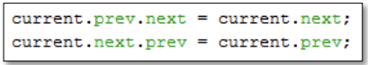

# Laporan Praktikum Pertemuan 12
Nama          : Aaisyah Nursalsabiil

NIM           : 2341720171

Kelas / absen : 1H - TI / 01

## 12.2 Percobaan 1


### 12.2.3 Pertanyaan
1. Jelaskan perbedaan antara single linked list dengan double linked lists!
Jawab : 
Single Linked List : Hanya memiliki pointer next, memori lebih hemat karena hanya memiliki 1 pointer pada setiap node.
Double Linked List : Memiliki 2 pointer yaitu next dan preview, menggunakan memori lebih banyak karena memiliki 2 pointer pada setiap node.

2. Perhatikan class Node, di dalamnya terdapat atribut next dan prev. Untuk apakah atribut tersebut?
Jawab : 
Atribut next digunakan untuk menunjukkan node selanjutnya dalam data yang ada.
Atribut prev digunakan untuk menunjukkan node sebelumnya dalam data yang ada.

3. Perhatikan konstruktor pada class DoubleLinkedLists. Apa kegunaan inisialisasi atribut head dan size seperti pada gambar berikut ini?

Jawab : 
Inisialisasi head dengan nilai null menandakan bahwa linked list saat pertama kali dibuat tidak memiliki elemen apa pun, yaitu, linked list tersebut kosong. Sedangkan size digunakan untuk menyimpan jumlah elemen dalam linked list, inisialisasi size = 0 menandakan bahwa kondisi awal masih kosong.


4.  Pada method addFirst(), kenapa dalam pembuatan object dari konstruktor class Node prev dianggap sama dengan null?
``` Node newNode = new Node(null, item, head); ```
Jawab : 
Dalam double linked list, method addFirst() menambahkan node baru di awal daftar. Node baru menjadi head, sehingga pointer prev diinisialisasi dengan null karena tidak ada node sebelumnya. Pointer next node baru diatur ke node yang saat ini menjadi head, dan jika daftar tidak kosong, prev dari head lama diatur ke node baru. Terakhir, head diperbarui ke node baru.

5. Perhatikan pada method addFirst(). Apakah arti statement head.prev = newNode ?
Jawab : 
Statement head.prev = newNode digunakan untuk memastikan bahwa node lama yang menjadi head sekarang mengenali node baru sebagai node sebelumnya, dan memastikan bahwa pointer next dan retv dapat diakses.

6. Perhatikan isi method addLast(), apa arti dari pembuatan object Node dengan mengisikan parameter prev dengan current, dan next dengan null?
``` Node newNode = new Node(current, item, null); ```
Jawab : 
Pembuatan object Node dengan parameter prev diisi dengan current dan next dengan null dalam method addLast() bertujuan untuk menambahkan node baru di akhir linked list, dengan node baru ini terhubung sebagai pointer dari node terakhir yang ada saat ini, dan memastikan node baru menjadi node terakhir (tail) dari linked list.

7. Pada method add(), terdapat potongan kode program sebagai berikut:

jelaskan maksud dari bagian yang ditandai dengan kotak kuning.
Jawab : 
if (current.prev == null) untuk menentukan apakah current adalah head dari linked list, jika prev dari current adalah null, berarti current adalah node pertama dalam linked list. Node newNode = new Node(null, item, current); untuk embuat node baru newNode dengan prev diinisialisasi ke null, item sebagai data, dan next menunjuk ke current. current.prev = newNode; untuk memperbarui referensi prev dari current untuk menendakan bahwa sekarang ada node baru di depannya. head = newNode; untuk mengatur newNode sebagai node pertama (head) dari linked list, karena node ini sekarang berada di depan current.

## 12.3 Percobaan 2


### 12.3.3 Pertanyaan
1. Apakah maksud statement berikut pada method removeFirst()?
head = head.next;
head.prev = null;
Jawab : 
`head = head.next` digunakan untuk mengubah head menjadi node berikutnya setelah node pertama dihapus.
`head.prev = null` digunakan untuk memastikan bahwa tidak ada node sebelumny (prev) yang terhubung dengan head baru.

2. Bagaimana cara mendeteksi posisi data ada pada bagian akhir pada method removeLast()?
Jawab : 
Method removeLast() mendeteksi posisi data di bagian akhir linked list dengan menggunakan loop untuk mencari node kedua terakhir (current.next.next == null). Setelah node kedua terakhir ditemukan, method ini menghapus node terakhir dengan memutuskan referensi next dari node kedua terakhir ke node terakhir, sehingga node terakhir dihapus dari linked list.

3. Jelaskan alasan potongan kode program di bawah ini tidak cocok untuk perintah remove!

Jawab : 
Tidak menghapus node pertama dengan benar karena kode ini tidak mengubah head ke node berikutnya, hanya mengubah referensi head.next. tidak menghapus node terakhir dengan benar karena Jika node yang ingin dihapus adalah node terakhir, maka tmp.next akan null, dan mencoba mengakses tmp.next.prev akan menyebabkan NullPointerException, dan tidak menghapus node tengah dengan benar karena hanya ditujukan untuk menghapus node setelah head (yaitu, node kedua). Namun, ini hanya benar jika head bukan node terakhir dan jika head.next tidak null.
4. Jelaskan fungsi kode program berikut ini pada fungsi remove!

Jawab :
current.prev.next = current.next; untuk mMemutuskan hubungan dari node sebelumnya (current.prev) ke node yang ingin dihapus (current) dengan mengatur next dari node sebelumnya untuk menunjuk ke node yang berada setelah node yang ingin dihapus (current.next). current.next.prev = current.prev; untuk memutuskan hubungan dari node yang berada setelah node yang ingin dihapus (current.next) ke node yang ingin dihapus (current) dengan mengatur prev dari node yang berada setelah current untuk menunjuk ke node sebelumnya dari current (current.prev).

## 12.4 Percobaan 3


### 12.4.3 Pertanyaan
1. Jelaskan method size() pada class DoubleLinkedLists!
Jawab : 
Dengan ada nya method size() kita bisa mengetahui berapa banyak elemen yang ada dalam double linked list.

2. Jelaskan cara mengatur indeks pada double linked lists supaya dapat dimulai dari indeks ke-1!
Jawab :
Dengan mengubah inisialisasi index dan i yang awalnya 0 menjadi 1 dan mengubah kondisi pada if menjadi index < 1 || index > size

3. Jelaskan perbedaan karakteristik fungsi Add pada Double Linked Lists dan Single Linked Lists!
Jawab : 
- Single Linked List : hanya memiliki pointer next sehingga hanya perlu menembukan node terakhir dan menambahkan node baru di belakangnya.
- Double Linked List : memiliki 2 pointer next dan prev sehingga harus mencaru node di posisi yang diinginkan, kemudian memperbarui pointer 'next' untuk menambahkan node baru.

4. Jelaskan perbedaan logika dari kedua kode program di bawah ini!
    a. 
    b. 
Jawab :
    a. Kode program pertama menggunakan variabel   size untuk menentukan apakah linked list kosong. Ini diasumsikan bahwa size selalu terjaga dan sesuai dengan jumlah elemen yang sebenarnya dalam linked list. 
    b. Kode program kedua hanya memeriksa keberadaan head. Jika head tidak ada, berarti linked list kosong. Pendekatan ini lebih langsung dan sederhana, terutama jika linked list hanya memiliki satu elemen, di mana size tidak terlalu relevan.

## 12.5 Tugas
1. Buat program antrian vaksinasi menggunakan queue berbasis double linked list sesuai ilustrasi (counter jumlah antrian tersisa di menu cetak(3) dan data orang yang telah divaksinasi di menu Hapus Data(2) harus ada)


2. Buatlah program daftar film yang terdiri dari id, judul dan rating menggunakan double linked lists, bentuk program memiliki fitur pencarian melalui ID Film dan pengurutan Rating secara descending. Class Film wajib diimplementasikan dalam soal ini


