# Laporan Praktikum Pertemuan 14 - Tree
Nama            : Aaisyah Nursalsabiil 
NIM             : 2341720171
Kelas / absen   : 1H - TI / 01

## 13.2.1 Percobaan 1
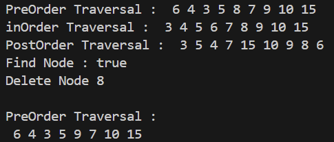

### 13.2.2 Pertanyaan
1. Mengapa dalam binary search tree proses pencarian data bisa lebih efektif dilakukan dibanding binary tree biasa?
Jawab :
Karena pada binary search tree node disusun sudah secara berurutan (Pohon Biner terurut), yang mana penempatan data berdasarkan Left Child akan selalu lebih kecil dari node induk, dan right child akan selalu lebih besar dari node induk.

2. Untuk apakah di class Node, kegunaan dari atribut left dan right?
Jawab : 
Pada class node atribut left berfungsi untuk menyimpan "left child" atau nilai yang lebih kecil dari root (node induk) dan atribut right berfungsi untuk menyimpan "right child" atau nilai yang lebih besar dari root (node induk)

3. a. Untuk apakah kegunaan dari atribut root di dalam class BinaryTree?
    Jawab :
    Untuk menyimpan data yang ada pada bagian paling atas dari tree (root)
    b. Ketika objek tree pertama kali dibuat, apakah nilai dari root?
    Jawab :
    Null, karena data masih kosong
4. Ketika tree masih kosong, dan akan ditambahkan sebuah node baru, proses apa yang akan terjadi?
Jawab : 
Akan terjadi proses insert atau add()

5. Perhatikan method add(), di dalamnya terdapat baris program seperti di bawah ini. Jelaskan 
secara detil untuk apa baris program tersebut?
``` 
if(data<current.data){
 if(current.left!=null){
 current = current.left;
 }else{
 current.left = new Node(data);
 break;
 }
} 
```
Jawab : 
Jika data memiliki nilai lebih kecil dari current maka atribut current akan menyimpan nilai dari current left atau current left akan menadi induk dari data yang baru dimasukkan, dan apabila current left bersifat kosong maka data baru yang dimasukkan akan menjadi current left atau left-child.

## 13.3.1 Percobaan 2
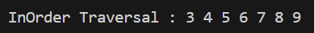

### 13.3.2 Pertanyaan
1. Apakah kegunaan dari atribut data dan idxLast yang ada di class BinaryTreeArray?
Jawab : 
- Atribut data digunakan untuk menyimpan elemen array.
- Atribut idxLast digunakan untuk menentukan index yang terakhir digunakan dalam array data untuk menyimpan elemen binary tree.

2. Apakah kegunaan dari method populateData()?
Jawab : 
Digunakan untuk menginisialisasi data dalam struktur pohon binary tree berbasis array.

3. Apakah kegunaan dari method traverseInOrder()?
Jawab : 
Berfungsi untuk melakukan traversal in-order pada binary tree yang disimpan pada array.

4. Jika suatu node binary tree disimpan dalam array indeks 2, maka di indeks berapakah posisi
left child dan rigth child masin-masing?
Jawab :
- 2 * 2 + 1 = 5, left child pada indeks ke 5
- 2 * 2 + 2 = 6, right child pada indeks ke 6

5. Apa kegunaan statement int idxLast = 6 pada praktikum 2 percobaan nomor 4?
Jawab : 
Menunjukkan idxLast atau batas indeks array adalah 6.

## 13.4 Tugas Praktikum
1. Buat method di dalam class BinaryTree yang akan menambahkan node dengan cara rekursif.
- Kode Program :
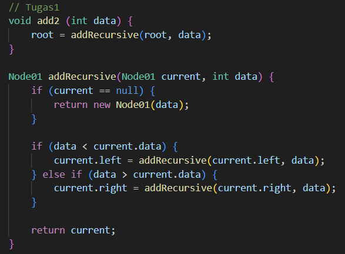

- Hasil :
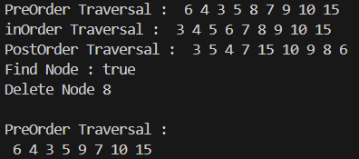

2. Buat method di dalam class BinaryTree untuk menampilkan nilai paling kecil dan yang paling besar yang ada di dalam tree.
- Kode :
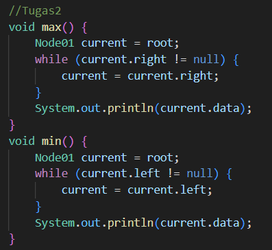
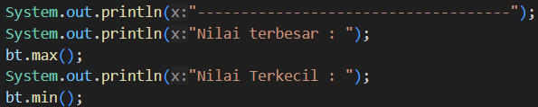
- Hasil :
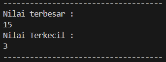

3. Buat method di dalam class BinaryTree untuk menampilkan data yang ada di leaf.
- Kode :
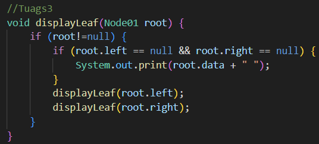
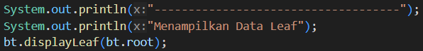

- Hasil :
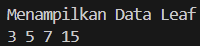

4. Buat method di dalam class BinaryTree untuk menampilkan berapa jumlah leaf yang ada di dalam tree.
- Kode :
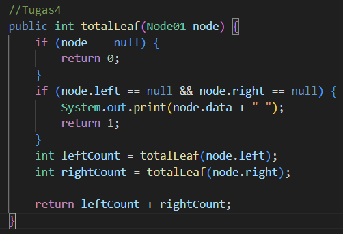
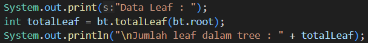

- Hasil :
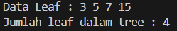

5. Modifikasi class BinaryTreeArray, dan tambahkan :
• method add(int data) untuk memasukan data ke dalam tree
• method traversePreOrder() dan traversePostOrder()
- Kode :
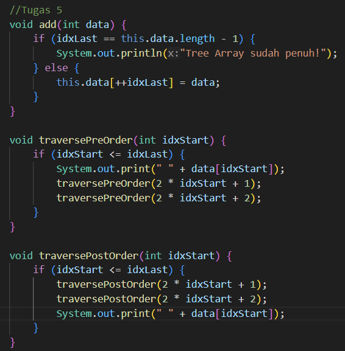
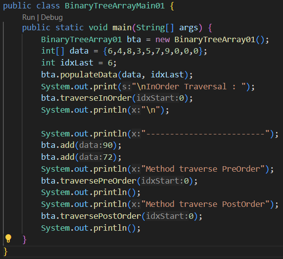

- Hasil :
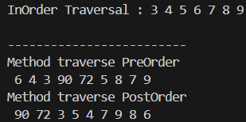