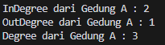

# Laporan Praktikum Pertemuan 15 - Graph
Nama            : Aaisyah Nursalsabiil 
NIM             : 2341720171
Kelas / absen   : 1H - TI / 01

## 13.2.1 Percobaan 1


### 13.2.2 Pertanyaan
1. Perbaiki kode program Anda apabila terdapat error atau hasil kompilasi kode tidak sesuai!

2. Pada class Graph, terdapat atribut list[] bertipe DoubleLinkedList. Sebutkan tujuan pembuatan variabel tersebut!
Jawab : 
Tujuan dari pembuatan variabel tersebut adalah untuk menyimpan edge dari graph yang menggunakan Double Linked List
3. Jelaskan alur kerja dari method removeEdge!
Jawab : 
Pada methode removeEdge akan menerima input gedung asal dan gedung tujuan yang akan dihapus. Kemudian input akan disesuaikan dengan data yang ada, jika input tersebut ditemukan maka akan dihapus dari list yang tersimpan pada list[]. Apabila input yang akan dihapus merupakan node pertama(head), maka head akan diubah ke node selanjutnya.
4. Apakah alasan pemanggilan method addFirst() untuk menambahkan data, bukan method add jenis lain saat digunakan pada method addEdge pada class Graph?
Jawab : 
Pemanggilan method addFirst() dilakukan karena pada struktur data Double Linked List digunakan untuk menambahkan elemen baru di awal list, dibandingkan dengan methode add() methode ini lebih membantu dalam mempercepat proses penambahan edge pada graf, terutama jika penambahan edge sering dilakukan pada awal list edge.
5. Modifikasi kode program sehingga dapat dilakukan pengecekan apakah terdapat jalur antara suatu node dengan node lainnya, seperti contoh berikut (Anda dapat memanfaatkan Scanner).
Jawab : 


## 13.2.1 Percobaan 2


### 13.2.2 Pertanyaan
1. Perbaiki kode program Anda apabila terdapat error atau hasil kompilasi kode tidak sesuai!

2. Apa jenis graph yang digunakan pada Percobaan 2?
Jawab :
Pada Percobaan 2 menggunakan adjacency matrix, yang menerapkan array 2D dengan size V x V dimana V adalah jumlah node pada graph.
3. Apa maksud dari dua baris kode berikut?
Jawab :
Dua baris kode tersebut digunakan untuk menambahkan edge antara gedung asal 1 dan gedung tujuan 2 dengan jarak 70 serta antara gedung asal 2 dan gedung tujuan 1 dengan jarak 80.
4. Modifikasi kode program sehingga terdapat method untuk menghitung degree, termasuk inDegree dan outDegree!
Jawab :


## Latihan Praktikum
- Percobaan 1
Kode Program 
```
public class Node01 {
    int data, jarak;
    Node01 prev, next;

    Node01(Node01 prev, int data, int jarak, Node01 next) {
        this.prev = prev;
        this.data = data;
        this.next = next;
        this.jarak = jarak;
    }
}
```

```
public class DoubleLinkedList {
    Node01 head;
    int size;

    public DoubleLinkedList() {
        head = null;
        size = 0;
    }

    public boolean isEmpty() {
        return head == null;
    }

    public void addFirst(int item, int jarak) {
        if (isEmpty()) {
            head = new Node01(null, item, jarak, null);
        } else {
            Node01 newNode = new Node01(null, item, jarak, head);
            head.prev = newNode;
            head = newNode;
        }
        size++;
    }

    public int getJarak(int index) throws Exception {
        if (isEmpty() || index >= size) {
            throw new Exception("Nilai index di luar batas");
        }

        Node01 tmp = head;
        for (int i = 0; i < index; i++) {
            tmp = tmp.next;
        }

        return tmp.jarak;
    }

    public int get(int index) throws Exception {
        if (isEmpty() || index >= size) {
            throw new Exception("Nilai indeks di luar batas");
        }

        Node01 tmp = head;
        for (int i = 0; i < index; i++) {
            tmp = tmp.next;
        }

        return tmp.data;
    }

    public void remove(int index) {
        Node01 current = head;
        while (current != null) {
            if (current.data == index) {
                if (current.prev != null) {
                    current.prev.next = current.next;
                } else {
                    head = current.next;
                }
                if (current.next != null) {
                    current.next.prev = current.prev;
                }
                break;
            }
            current = current.next;
        }
        size--;
    }

    public int size() {
        return size;
    }

    public void clear() {
        head = null;
        size = 0;
    }

    public void updateJarak(int tujuan, int jarakBaru) throws Exception {
        Node01 current = head;
        boolean found = false;
        while (current != null) {
            if (current.data == tujuan) {
                current.jarak = jarakBaru;
                found = true;
                break;
            }
            current = current.next;
        }
        if (!found) {
            throw new Exception("Tujuan tidak ditemukan dalam daftar");
        }
    }
}
```

```
public class Graph01 {
    int vertex;
    DoubleLinkedList list[];

    public Graph01(int v) {
        vertex = v;
        list = new DoubleLinkedList[v];
        for (int i = 0; i < v; i++) {
            list[i] = new DoubleLinkedList();
        }
    }

    public void addEdge(int asal, int tujuan, int jarak) {
        //directed
        list[asal].addFirst(tujuan, jarak);
        //undirected
        //list[tujuan].addFirst(asal, jarak);
    }

    public void degree(int asal) throws Exception {
        //undirected
        //System.out.println("Degree dari gedung " + (char) ('A' + asal) + " : " +list[asal].size());
        //directed
        int k, totalIn = 0, totalOut = 0;
        for (int i = 0; i < vertex; i++) {
            //indegree
            for (int j = 0; j < list[i].size(); j++) {
                if (list[i].get(j) == asal) {
                    ++totalIn;
                }
            }
            //outdegree
            for (k = 0; k < list[asal].size(); k++) {
                list[asal].get(k);
            }
            totalOut = k;
        }
        System.out.println("InDegree dari Gedung " + (char) ('A' + asal) + " : " + totalIn);
        System.out.println("OutDegree dari Gedung " + (char) ('A' + asal) + " : " + totalOut);
        System.out.println("Degree dari Gedung " + (char) ('A' + asal) + " : " + (totalIn + totalOut));
    }

    public void removeEdge(int asal, int tujuan) throws Exception {
        for (int i = 0; i < vertex; i++) {
            if (i == tujuan) {
                list[asal].remove(tujuan);
            }
        }
    }

    public void removeAllEdge() {
        for (int i = 0; i < vertex; i++) {
            list[i].clear();
        }
        System.out.println("Graf berhasil dikosongkan");
    }

    public void printGraph() throws Exception {
        for (int i = 0; i < vertex; i++) {
            if (list[i].size() > 0) {
                System.out.print("Gedung " + (char) ('A' + i) + " terhubung dengan ");
                for (int j = 0; j < list[i].size(); j++) {
                    System.out.print((char) ('A' + list[i].get(j)) + " (" + list[i].getJarak(j) + " m), ");
                }
                System.out.println("");
            }
        }
        System.out.println("");
    }

    public boolean isAdjacent(int asal, int tujuan) throws Exception {
        for (int i = 0; i < list[asal].size(); i++) {
            if (list[asal].get(i) == tujuan) {
                return true;
            }
        }
        return false;
    }

    public void cekEdge(int asal, int tujuan) throws Exception {
        if (isAdjacent(asal, tujuan)) {
            System.out.print("Gedung " + (char) ('A' + asal) + " dan " + (char) ('A' + tujuan) + " bertetangga\n");
            System.out.println("");
        } else {
            System.out.print("Gedung " + (char) ('A' + asal) + " dan " + (char) ('A' + tujuan) + " tidak bertetangga\n");
            System.out.println("");
        }
    }

    public void updateJarak(int asal, int tujuan, int jarakBaru) throws Exception {
        if (isAdjacent(asal, tujuan)) {
            list[asal].updateJarak(tujuan, jarakBaru);
            System.out.println("Jarak dari Gedung " + (char) ('A' + asal) + " ke Gedung " + (char) ('A' + tujuan) + " telah diperbarui menjadi " + jarakBaru + " m");
        } else {
            System.out.println("Tidak ada jalan langsung dari Gedung " + (char) ('A' + asal) + " ke Gedung " + (char) ('A' + tujuan));
        }
    }

    public int hitungEdge() {
        int jumlahEdge = 0;
        for (int i = 0; i < vertex; i++) {
            jumlahEdge += list[i].size();
        }
        System.out.println("Total edge dalam graf: " + jumlahEdge);
        return jumlahEdge;
    }
}
```

```
import java.util.Scanner;
public class GraphMain01 {
    public static void menu() {
        System.out.println("Pilih menu : ");
        System.out.println("1. Add Edge");
        System.out.println("2. Remove Edge");
        System.out.println("3. Degree");
        System.out.println("4. Print Graph");
        System.out.println("5. Cek Edge");
        System.out.println("6. Ubah Jarak");
        System.out.println("7. Hitung Edge");
        System.out.println("8. Keluar");
        System.out.println("-------------------------------");
    }

    public static void main(String[] args) throws Exception {
        Scanner sc = new Scanner(System.in);

        System.out.print("Masukkan jumlah vertex : ");
        int v = sc.nextInt();
        Graph01 gedung = new Graph01(v);

        int pilih;
        do {
            menu();
            pilih = sc.nextInt();
            sc.nextLine();

            switch (pilih) {
                case 1:
                    System.out.print("Masukkan gedung asal : ");
                    int asal = sc.nextInt();
                    System.out.print("Masukkan gedung tujuan : ");
                    int tujuan = sc.nextInt();
                    System.out.print("Masukkan jarak gedung : ");
                    int jarak = sc.nextInt();
                    gedung.addEdge(asal, tujuan, jarak);;
                    break;

                case 2:
                    System.out.print("Masukkan asal gedung yang akan dihapus : ");
                    asal = sc.nextInt();
                    System.out.print("Masukkan gedung tujuan yang akan dihapus : ");
                    tujuan = sc.nextInt();
                    gedung.removeEdge(asal, tujuan);
                    break;

                case 3:
                    System.out.print("Masukkan vertex untuk mengecek degree :");
                    asal = sc.nextInt();
                    gedung.degree(asal);
                    break;

                case 4:
                    gedung.printGraph();
                    break;

                case 5:
                    System.out.print("Masukkan asal gedung :");
                    asal = sc.nextInt();
                    System.out.print("Masukkan gedung tujuan : ");
                    tujuan = sc.nextInt();
                    gedung.cekEdge(asal, tujuan);
                    break;

                case 6:
                    System.out.print("Masukkan asal gedung :");
                    asal = sc.nextInt();
                    System.out.print("Masukkan gedung tujuan : ");
                    tujuan = sc.nextInt();
                    System.out.print("Masukkan jarak baru gedung :");
                    int jarakBaru = sc.nextInt();
                    gedung.updateJarak(asal, tujuan, jarakBaru);
                    break;

                case 7:
                    gedung.hitungEdge();
                    break;

                case 8:
                    System.out.println("Keluar dari program.");
                    sc.close();
                    return;
            }
        } while (pilih == 1 || pilih == 2 || pilih == 3 || pilih == 4 || pilih == 5 || pilih == 6 || pilih == 7 || pilih == 8);
    }
}
```
- Percobaan 2
```
public class GraphMatriks01 {
    int vertex;
    int[][] matriks;

    public GraphMatriks01(int v) {
        vertex = v;
        matriks = new int[v][v];
    }

    public void makeEdge(int asal, int tujuan, int jarak) {
        matriks[asal][tujuan] = jarak;
    }

    public void removeEdge(int asal, int tujuan) {
        //matriks[asal][tujuan] = -1;
        matriks[asal][tujuan] = 0;
    }

    public void printGraph() {
        for (int i = 0; i < vertex; i++) {
            System.out.print("Gedung " + (char) ('A' + i) + " : ");
            for (int j = 0; j < vertex; j++) {
                if (matriks[i][j] != -1) {
                    System.out.print("Gedung " + (char) ('A' + i) + " (" + matriks[i][j] + " m), ");
                }  
            }
        System.out.println("");
        }
    }

    public void degree(int asal) {
        int totalIn = 0, totalOut = 0;
        for (int i = 0; i < vertex; i++) {
            //indegree
            if (matriks[i][asal] != 0) {
                totalIn++;
            }
            //outdegree
            if (matriks[asal][i] != 0) {
                totalOut++;   
            }
        }
        System.out.println("InDegree dari Gedung " + (char) ('A' + asal) + " : " + totalIn);
        System.out.println("OutDegree dari Gedung " + (char) ('A' + asal) + " : " + totalOut);
        System.out.println("Degree dari Gedung " + (char) ('A' + asal) + " : " + (totalIn + totalOut));
    }

    public void cekEdge(int asal, int tujuan) {
        if (matriks[asal][tujuan] != 0) {
            System.out.println("Gedung " + (char) ('A' + asal) + " dan gedung " + (char) ('A' + tujuan) + " bertetangga dengan jarak " + matriks[asal][tujuan]);
        } else {
            System.out.println("Gedung " + (char) ('A' + asal) + " dan gedung " + (char) ('A' + tujuan) + " tidak bertetangga");
        }
    }

    public int hitungEdge() {
        int jumlahEdge = 0;
        for (int i = 0; i < vertex; i++) {
            for (int j = 0; j < vertex; j++) {
                if (matriks[i][j] != 0) {
                    jumlahEdge++;
                }
            }
        }
        System.out.println("Total edge dalam graf: " + jumlahEdge);
        return jumlahEdge;
    }
}
``` 
output :


