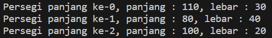

# Laporan Praktikum Pertemuan 3

Nama            : Aaisyah Nursalsabiil Ni Patriarti
NIM             : 2341720171
Kelas / absen   : 1H - TI / 01

## 3.2 Percobaan 1 : Membuat Array dari Object, Mengisi dan Menampilkan

### 3.2.3 Pertanyaan
1. Berdasarkan uji coba 3.2, apakah class yang akan dibuat array of object harus selalu memiliki
atribut dan sekaligus method?Jelaskan!
Jawaban : 
Kebutuhan untuk memiliki atribut dan metode dalam sebuah kelas digunakan sebagai array of object sangat bergantung pada kebutuhan spesifik dari class itu sendiri.

2. Apakah class PersegiPanjang memiliki konstruktor?Jika tidak, kenapa dilakukan pemanggilan
konstruktur pada baris program berikut :

Jawaban : 
Ya, karena konstruktor pada class PersegiPanjang merupakan konstruktor default atau konstruktor tanpa parameter sehingga instansiasi object harus menggunakan konstruktor sesuai dengan konstruktor pada class.

3. Apa yang dimaksud dengan kode berikut ini :

Jawaban : 
Kode diatas merupakan instansiasi array of object

4. Apa yang dimaksud dengan kode berikut ini:

Jawaban : 
Kode diatas merupakan contoh dari penggunaan array of object atau instansiasi dan pemberian nilai atribut pada array of object.

5.  Mengapa class main dan juga class PersegiPanjang dipisahkan pada uji coba 3.2?
Jawaban :
Karena akan melakukan pemanggilan array of object pada class main sehingga class main dan class PersegiPanjang perlu dipisah.

## 3.3 Percobaan 2 :  Menerima Input Isian Array Menggunakan Looping

### 3.3.3 Pertanyaan
1. Apakah array of object dapat diimplementasikan pada array 2 Dimensi?
Jawaban : 
Ya, array of object dapat diimplementasikan dalam array dua dimensi. dengan setiap elemen dari array dua dimensi tersebut adlaah sebuah objek.

2. Jika jawaban soal no satu iya, berikan contohnya! Jika tidak, jelaskan!
Jawaban : 
PersegiPanjang[][] array2D = new PersegiPanjang[2][2];

3. Jika diketahui terdapat class Persegi yang memiliki atribut sisi bertipe integer, maka kode
dibawah ini akan memunculkan error saat dijalankan. Mengapa?
Jawaban :
Karena belum melakukan pembuatan object Persegi pada pgArray index ke-5.

4. Modifikasi kode program pada praktikum 3.3 agar length array menjadi inputan dengan Scanner!
Jawaban : 

5. Apakah boleh Jika terjadi duplikasi instansiasi array of objek, misalkan saja instansiasi dilakukan
pada ppArray[i] sekaligus ppArray[0]?Jelaskan !
Jawaban : 
Ya, memang dimungkinkan untuk melakukan duplikasi instansiasi array of object, seperti dalam kasus yang kamu sebutkan di mana instansiasi dilakukan pada ppArray[i] sekaligus ppArray[0]. Hal ini akan membuat objek yang pertama diinstansiasi pada ppArray[0] kehilangan referensi dan tidak akan dapat diakses lagi. Akibatnya, ini bisa menyebabkan kebingungan atau bug dalam program.

## Percobaan 3 : Penambahan Operasi Matematika di Dalam Method

### 3.4.3 Pertanyaan
1. Dapatkah konstruktor berjumlah lebih dalam satu kelas? Jelaskan dengan contoh!
Jawaban : 
Ya, sebuah kelas dapat memiliki lebih dari satu konstruktor. Konstruktor yang berbeda dapat memiliki parameter-parameter yang berbeda atau jumlah yang berbeda, yang memungkinkan kelas tersebut untuk diinisialisasi dengan cara yang berbeda tergantung pada kebutuhan atau konteks pemanggilan. Contohnya sebagai berikut :

2. Jika diketahui terdapat class Segitiga seperti berikut ini:

Tambahkan konstruktor pada class Segitiga tersebut yang berisi parameter int a, int t
yang masing-masing digunakan untuk mengisikan atribut alas dan tinggi.

3. Tambahkan method hitungLuas() dan hitungKeliling() pada class Segitiga
tersebut. Asumsi segitiga adalah segitiga siku-siku. (Hint: Anda dapat menggunakan bantuan
library Math pada Java untuk mengkalkulasi sisi miring)

4. Pada fungsi main, buat array Segitiga sgArray yang berisi 4 elemen, isikan masing-masing
atributnya sebagai berikut:
sgArray ke-0 alas: 10, tinggi: 4
sgArray ke-1 alas: 20, tinggi: 10
sgArray ke-2 alas: 15, tinggi: 6
sgArray ke-3 alas: 25, tinggi: 10

5. Kemudian menggunakan looping, cetak luas dan keliling dengan cara memanggil method
hitungLuas() dan hitungKeliling().

    Jawaban class Segitga : 

## 3.5 Latihan Praktikum
1. Buatlah program yang dapat menghitung luas permukaan dan volume bangun ruang kerucut, limas segi empat sama sisi, dan bola. Buatlah 3 (tiga) class sesuai dengan jumlah jenis bangun ruang. Buatlah satu main class untuk membuat array of objects yang menginputkan atribut atribut yang ada menggunakan konstruktor semua bangun ruang tersebut. Dengan ketentuan,
    a. Buat looping untuk menginputkan masing-masing atributnya, kemudian tampilkan luas permukaan dan volume dari tiap jenis bangun ruang tersebut.
    b. Pada kerucut, inputan untuk atribut hanya jari-jari dan sisi miring
    c. Pada limas segi empat sama sisi, inputan untuk atribut hanya panjang sisi alas dan tinggi limas
    d. Pada bola, inpuntan untuk atribut hanya jari-jari
    
    
    

2. Sebuah kampus membutuhkan program untuk menampilkan informasi mahasiswa berupa nama, nim, jenis kelamin dan juga IPK mahasiswa. Program dapat menerima input semua informasi tersebut, kemudian menampilkanya kembali ke user. Implementasikan program tersebut jika dimisalkan terdapat 3 data mahasiswa yang tersedia.

3. Modifikasi program Latihan no.2 di atas, sehingga bisa digunakan untuk menghitung rata-rata IPK,
serta menampilkan data mahasiswa dengan IPK terbesar! (gunakan method untuk masing-masing
proses tersebut)

