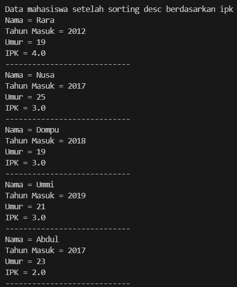
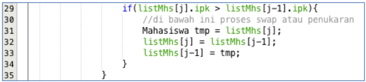
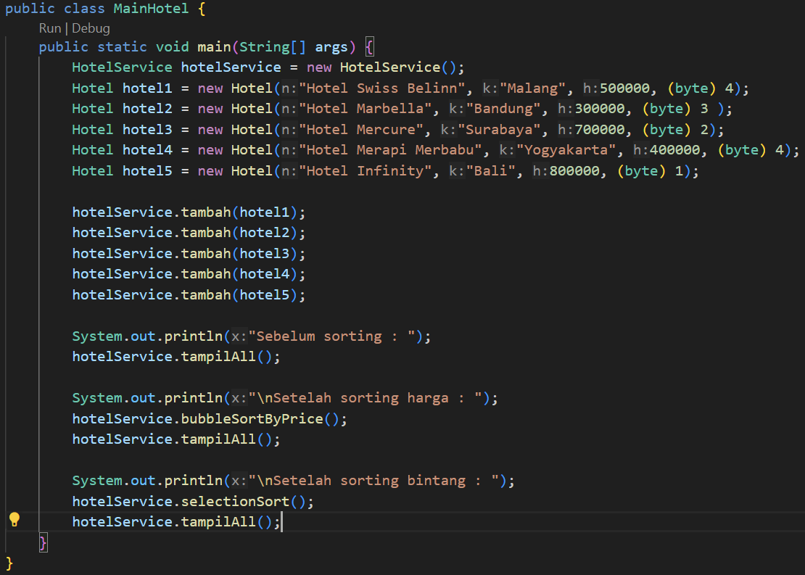

# Laporan Praktikum Pertemuan 6

Nama            : Aaisyah Nursalsabiil Ni Patriarti

NIM             : 2341720171

Kelas / absen   : 1H - TI / 01

## 5.2 Mengurutkan Data Mahasiswa Berdasarkan IPK Menggunakan Bubble Sort



### 5.2.3 Pertanyaan
1. Terdapat di method apakah proses bubble sort?
jawaban : 
Proses bubble sort terdapat dalam method bubbleSort() pada Class 
DaftarMahasiswaBerprestasi.

2. Di dalam method bubbleSort(), terdapat baris program seperti di bawah ini:

Untuk apakah proses tersebut?
jawaban : 
Proses tersebut merupakan bagian dari langkah swap dalam algoritma bubble sort. Pada bagian ini, dilakukan pengecekan apakah nilai ipk dari Mahasiswa pada indeks ke-j lebih besar dari nilai ipk Mahasiswa pada indeks ke-(j-1). Jika kondisi tersebut terpenuhi, maka dilakukan pertukaran posisi antara Mahasiswa pada indeks ke-j dengan Mahasiswa pada indeks ke-(j-1) untuk mengurutkan Mahasiswa berdasarkan nilai ipk secara menurun (descending).
3. Perhatikan perulangan di dalam bubbleSort() di bawah ini:

a.j Apakah perbedaan antara kegunaan perulangan i dan perulangan j? 
Jawaban : 
Perulangan i mengatur iterasi pada setiap fase atau langkah dalam algoritma, menandakan jumlah elemen yang telah di proses dan diurutkan, sementara perulangan j mengatur iterasi dalam satu fase tertentu, digunakan untuk membandingkan dan melakukan penukaran antara dua elemen yang berdekatan.
b. Mengapa syarat dari perulangan i adalah i < listMhs.length-1 ?
Jawaban : 
Karena dalam algoritma bubble sort, setiap iterasi luar dari perulangan i akan memindahkan setidaknya satu elemen terbesar yang telah diurutkan akan berada pada posisi ```listMhs.length-i-1```. Dengan demikian, iterasi berikutnya tidak perlu melibatkan elemen terakhir karena sudah pasti berada di posisi yang tepat. Sehingga, perulangan luar dapat berhenti pada ```i < listMhs.length-1``` untuk menghindari iterasi yang tidak perlu.
c. Mengapa syarat dari perulangan j adalah j < listMhs.length-i ?
Jawaban : 
Karena setiap iterasi dari perulangan luar (iterasi i) mengghasilkan satu Mahasiswa dengan nilai ipk terbesar untuk iterasi tersebut, yang kemudian akan ditempatkan di posisi akhir dari array setelah dilakukan pengurutan. Oleh karena itu, tidak perlu membandingkan Mahasiswa di posisi akhir yang sudah terurut pada iterasi-iterasi selanjutnya. Hal ini menghindari perbandingan yang tidak perlu dan mengoptimalkan kinerja algoritma bubble sort.
d. Jika banyak data di dalam listMhs adalah 50, maka berapakali perulangan i akan berlangsung? Dan ada berapa Tahap bubble sort yang ditempuh?
Jawaban : 
Jumlah tahapan bubble sort yang ditempuh sama dengan jumlah perulangan i. Jika jumlah data di dalam listMhs adalah 50, maka perulangan i akan berlangsung sebanyak 49 kali, dan terdapat juga 49 tahap dalam algoritma bubble sort.

## 5.3 Mengurutkan Data Mahasiswa Berdasarkan IPK Menggunakan Selection Sort


### 5.3.3. Pertanyaan
Di dalam method selection sort, terdapat baris program seperti di bawah ini:

Untuk apakah proses tersebut, jelaskan!
Jawaban : 
Untuk menginisialisasi idxMin dengan indeks i sebagai indeks minimum awal. Kemudian dilakukan perulangan pada array dimulai dari indeks i+1 untuk mencari nilai minimum dari bagian array yang belum diurutkan. Jika nilai ipk dari Mahasiswa pada indeks j lebih kecil daripada nilai ipk Mahasiswa pada idxMin, maka idxMin akan diupdate menjadi j. Setelah selesai perulangan, idxMin akan berisi indeks dari Mahasiswa dengan nilai ipk terkecil di bagian array yang belum diurutkan.

## 5.4 Mengurutkan Data Mahasiswa Berdasarkan IPK Menggunakan Insertion Sort


### 5.4.3 Pertanyaan
Ubahlah fungsi pada InsertionSort sehingga fungsi ini dapat melaksanakan proses sorting dengan cara descanding.
Jawaban : 
Kode Program :
```void insertionSort(){
        for(int i = 1; i < listMhs.length; i++){
            Mahasiswa tmp = listMhs[i];
            int j = i;
            while (j > 0 && listMhs[j-1].ipk < tmp.ipk){
                listMhs[j] = listMhs[j-1];
                j--;
            }
            listMhs[j] = tmp;
        }
    }
```
Output :
 

## 5.5 Latihan Praktikum
Sebuah platform travel yang menyediakan layanan pemesanan kebutuhan travelling sedang mengembangkan backend untuk sistem pemesanan/reservasi akomodasi (penginapan), salah satu fiturnya adalah menampilkan daftar penginapan yang tersedia berdasarkan pilihan filter yang diinginkan user Daftar penginapan ini harus dapat 
disorting berdasarkan 
1. Harga dimulai dari harga termurah ke harga tertinggi. 
2. Rating bintang penginapan dari bintang tertinggi (5) ke terendah (1) 
Buatlah proses sorting data untuk kedua filter tersebut dengan menggunakan algoritma bubble sort dan selection sort.
Jawaban :
Kode Program : 
Hotel
 
HotelService 
 
MainHotel
 
Output : 
 
