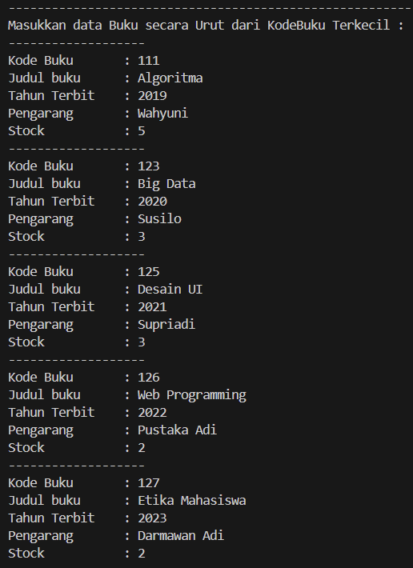
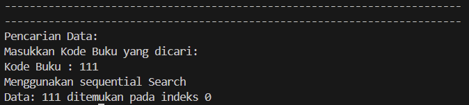
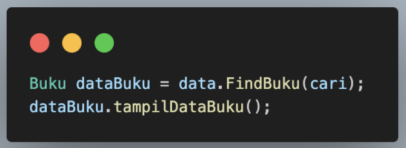

# Laporan Praktikum Pertemuan 7
Nama          : Aaisyah Nursalsabiil

NIM           : 2341720171

Kelas / absen : 1H - TI / 01

## 6.2. Searching / Pencarian Menggunakan Agoritma Sequential Search

### 6.2.3. Pertanyaan
1. Jelaskan fungsi break yang ada pada method FindSeqSearch!
2. Jika Data Kode Buku yang dimasukkan tidak terurut dari kecil ke besar. Apakah program masih dapat berjalan? Apakah hasil yang dikeluarkan benar? Tunjukkan hasil screenshoot untuk bukti dengan kode Buku yang acak. Jelaskan Mengapa hal tersebut bisa terjadi?
3. Buat method baru dengan nama FindBuku menggunakan konsep sequential search dengan tipe method dari FindBuku adalah BukuNoAbsen. Sehingga Anda bisa memanggil method tersebut pada class BukuMain seperti gambar berikut :
