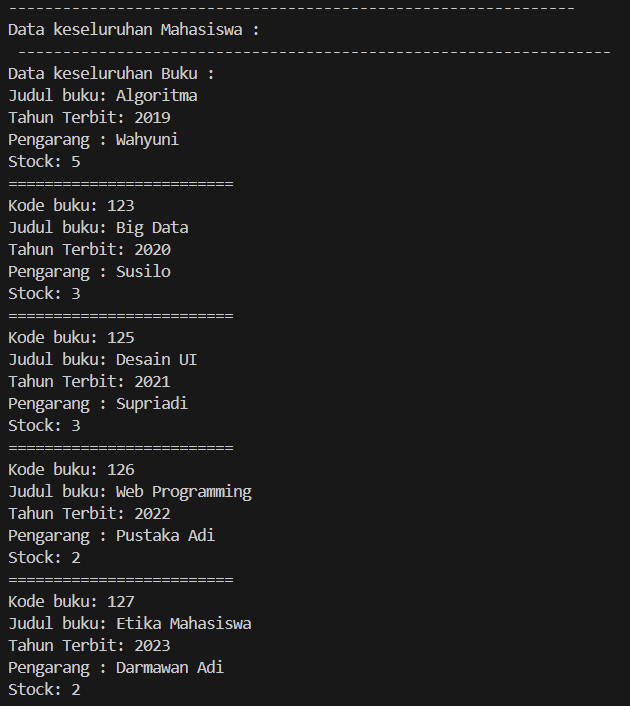

# Laporan Praktikum Pertemuan 7
Nama          : Aaisyah Nursalsabiil

NIM           : 2341720171

Kelas / absen : 1H - TI / 01

## 6.2. Searching / Pencarian Menggunakan Agoritma Sequential Search



Penambahan method TampilData


### 6.2.3. Pertanyaan
1. Jelaskan fungsi break yang ada pada method FindSeqSearch!
Jawaban :
Fungsi break dalam metode FindSeqSearch adalah untuk menghentikan pencarian segera setelah menemukan buku dengan kodeBuku yang sesuai. Ini meningkatkan efisiensi dengan menghindari pencarian lebih lanjut setelah ditemukan kecocokan.

2. Jika Data Kode Buku yang dimasukkan tidak terurut dari kecil ke besar. Apakah program masih dapat berjalan? Apakah hasil yang dikeluarkan benar? Tunjukkan hasil screenshoot untuk bukti dengan kode Buku yang acak. Jelaskan Mengapa hal tersebut bisa terjadi?
Jawaban :
Program masih dapat berjalan dengan baik meskipun data kode buku yang 
dimasukan tidak terurut dari kecil ke besar. Hal ini terjadi karena algoritma pencarian sequential search tidak memerlukan data yang terurut untuk berjalan.
Hasil screenshot :
Dari hasil eksekusi dibawah, dapat dilihat bahwa meskipun data tidak terurut, program masih dapat mencari dan menemukan data dengan kode buku yang dimasukkan.


3. Buat method baru dengan nama FindBuku menggunakan konsep sequential search dengan tipe method dari FindBuku adalah BukuNoAbsen. Sehingga Anda bisa memanggil method tersebut pada class BukuMain seperti gambar berikut :

Jawaban : 
```
public Buku01 FindBuku(String cari) {
        for (int j = 0; j < idx; j++) {
            if (listBk[j].judulBuku.equalsIgnoreCase(cari)) {
                return listBk[j];
            }
        }
        return null;
    } 
```


## 6.3. Searching / Pencarian Menggunakan Binary Search


### 6.3.3. Pertanyaan
1. Tunjukkan pada kode program yang mana proses divide dijalankan!
```
return FindBinarySearch(cari, left, mid-1); <br>
return FindBinarySearch(cari, mid + 1, right);
```
2. Tunjukkan pada kode program yang mana proses conquer dijalankan!
```
return FindBinarySearch(cari, left, mid-1); <br>
return FindBinarySearch(cari, mid + 1, right);
```
3. Jika data Kode Buku yang dimasukkan tidak urut. Apakah program masih dapat berjalan? Mengapa demikian! Tunjukkan hasil screenshoot untuk bukti dengan kode Buku yang acak. Jelaskan Mengapa hal tersebut bisa terjadi? 
Jawaban : 
Jika data Kode Buku yang dimasukkan tidak urut, program tetap dapat berjalan namun algoritma pencarian biner (binary search) tidak akan ditemukan. Hal ini terjadi karena binary search hanya dapat digunakan pada data yang sudah terurut.Ketika data tidak terurut, binary search tidak dapat menemukan elemen yang dicari dengan benar karena asumsi dari binary search adalah bahwa elemen-elemen dalam array sudah dalam urutan yang benar. Jika data tidak urut, binary search tidak dapat menentukan apakah elemen yang dicari berada di setengah kiri atau kanan array, sehingga tidak akan memberikan hasil yang akurat.
Hasil Screenshot :


4. Jika Kode Buku yang dimasukkan dari Kode Buku terbesar ke terkecil (misal : 20215, 20214, 20212, 20211, 20210) dan elemen yang dicari adalah 20210. Bagaimana hasil dari binary search? Apakah sesuai? Jika tidak sesuai maka ubahlah kode program binary seach agar hasilnya sesuai!


Modifikasi Kode Program :

Hasil Modifikasi : 

## 6.4. Percobaan Pengayaan Divide and Conquer


## 6.5. Latihan Praktikum
1. Modifikasi percobaan diatas dengan ketentuan berikut ini
    - Ubah tipe data dari kode Buku yang awalnya int menjadi String
    - Tambahkan method untuk pencarian kode Buku (bertipe data String) dengan menggunakan sequential search dan binary search.
    
    
    
2. Modifikasi percobaan searching diatas dengan ketentuan berikut ini
    - Tambahkan method pencarian judul buku menggunakan sequential search dan binary search. Sebelum dilakukan searching dengan binary search data harus dilakukan pengurutan dengan menggunakan algoritma Sorting (bebas pilih algoritma sorting apapun)! Sehingga ketika input data acak, maka algoritma searching akan tetap berjalan
    
    
    
    - Buat aturan untuk mendeteksi hasil pencarian judul buku yang lebih dari 1 hasil dalam bentuk kalimat peringatan! Pastikan algoritma yang diterapkan sesuai dengan kasus yang diberikan!
    
    
    