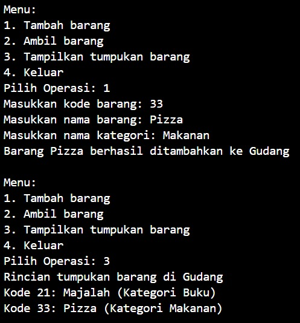

# Laporan Praktikum Pertemuan 8
Nama          : Aaisyah Nursalsabiil

NIM           : 2341720171

Kelas / absen : 1H - TI / 01

## 2.1 Percobaan 1 : Penyimpanan Tumpukan Brang dalam Gudang



### 2.1.3 Pertanyaan
1. Lakukan perbaikan pada kode program, sehingga keluaran yang dihasilkan sama dengan verifikasi hasil percobaan! Bagian mana saja yang perlu diperbaiki? 
Jawab: 
- Method lihatBarangTeratas
sebelum : 
``` 
public Barang01 lihatBarangTeratas(){
        if(!isEmpty()){
```
setelah : 
``` 
public Barang01 lihatBarangTeratas(){
        if(!cekKosong()){
```
 - Method tampilkanBarang
 sebelum :
 ``` for (int i = 0 i <= 0; i++) { ```
setelah : 
``` for (int i = top; i >= 0; i--) { ```

 2. Berapa banyak data barang yang dapat ditampung di dalam tumpukan Tunjukkan potongan kode programnya!
Jawab: 
Barang yang dapat ditampung yaitu 7,
``` Gudang08 gudang = new Gudang08(7); ```

3. Mengapa perlu pengecekan kondisi !cekKosong() pada method tampilkanBarang? Kalau kondisi tersebut dihapus, apa dampaknya?
Jawab : 
Digunakan untuk memastikan apakah tumpukan barang tidak kosong sebelum menampilkan barang. Apabila tumukan kosong maka tidak ada yang perlu ditamilkan. Jika kondisi !cekKosong() dihapus maka akan menampilkan isi tumpukan barang tanpa pengecekan kosong atau tidaknya tumpukan barang. Dan jika tumpukan barang kosong maka bisa saja terjadi error NullPointerException.

4. Modifikasi kode program pada class Utama sehingga pengguna juga dapat memilih operasi lihat barang teratas, serta dapat secara bebas menentukan kapasitas gudang!
Jawab : 


5. Commit dan push kode program ke Github

## 2.2 Percobaan 2 : Konversi Kode Barang ke Biner


### 2.2.3 Pertanyaan
1. Pada method konversiDesimalKeBiner, ubah kondisi perulangan menjadi while (kode != 0), bagaimana hasilnya? Jelaskan alasannya!

2. Jelaskan alur kerja dari method konversiDesimalKeBiner!
Jawab :
- Pertama, method membuat objek StackKonversi01 (untuk menyimpan sisa pembagian dalam proses konversi).
- Didalam perilangan while, nilai kode dibagi dengan 2 dan sisa dari pembagian (sisa) dimasukkan ke dalam tumpukan stack.push(sisa). Perulangan akan berlanjut selama nilai kode tidak sama dengan 0.
- Lalu dilakukan pengambilan sisa pembagian dari tumpukan satu per satu dengan menggunakan perulangan while lagi. Sisa yang diambil dari tumpukan digabungkan menjadi sebuah string.
- Hasil konversi biner dikembalikan sebagai hasil method pada (return biner).

## 2.3 Percobaan 3: Konversi Notasi Infix ke Postfix


### 2.3.3 Pertanyaan
1. Pada method derajat, mengapa return value beberapa case bernilai sama? Apabila return value diubah dengan nilai berbeda-beda setiap case-nya, apa yang terjadi?
Jawab : 
Karena beberapa operator tertentu memiliki tingkat prioritas yang sama. Jika return value diubah maka tingkat prioritas operator akan berubah. Hal ini dapat mengakibatkan hasil yang tidak sesuai dengan aturan prioritas operator yang umum. Misalnya, jika operasi perkalian memiliki prioritas lebih rendah daripada operasi penjumlahan, hasil konversi dari notasi infix ke postfix akan terdapat kesalahan.

2. Jelaskan alur kerja method konversi!
Jawab :

```     String P = ""; ```
- Inisialisasi string kosong P yang akan menyimpan hasil konversi dari notasi infix menjadi notasi postfix.

``` for (int i = 0; i < n; i++) { c = Q.charAt(i); ```
- Iterasi melalui setiap karakter dalam string Q menggunakan loop for.


3. Pada method konversi, apa fungsi dari potongan kode berikut?
        ``` c =  Q.charAt(i); ```
Jawab : 
Berfungsi untuk mengambil karakter pada indeks ke-i dari string Q dan 
menyimpannya ke dalam variabel c

## 2.4 Latihan Praktikum
Perhatikan dan gunakan kembali kode program pada Percobaan 1. Tambahkan dua method berikut pada class Gudang:
- Method lihatBarangTerbawah digunakan untuk mengecek barang pada tumpukan terbawah
- Method cariBarang digunakan untuk mencari ada atau tidaknya barang berdasarkan kode
barangnya atau nama barangnya

Jawab :


