# Laporan Praktikum Pertemuan 10
Nama          : Aaisyah Nursalsabiil

NIM           : 2341720171

Kelas / absen : 1H - TI / 01

## 10.2 Praktikum 1
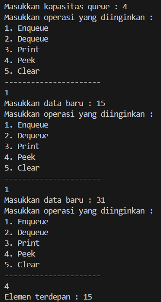

### 10.2.3 Pertanyaan
1. Pada konstruktor, mengapa nilai awal atribut front dan rear bernilai -1, sementara atribut size bernilai 0?
Jawab : 
Pemberian nilai -1 untuk front dan rear bertujuan untuk menandakan bahwa antrian dalam keadaan kosong saat inisialisasi, karena tidak ada elemen yang terletak pada indeks tersebut. Sedangkan nilai awal 0 untuk size menunjukkan bahwa saat inisialisasi, antrian memang kosong karena tidak ada elemen yang ditambahkan. Yang berarti ukuran antrian pada awalnya adalah 0. Saat penambahan elemen, nilai rear akan ditingkatkan, dan saat penghapusan elemen, nilai front akan ditingkatkan. Sedangkan nilai size akan diperbarui sesuai dengan jumlah elemen yang ada dalam antrian.

2. Pada method Enqueue, jelaskan maksud dan kegunaan dari potongan kode berikut!
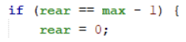 
Jawab : 
Kode ``` if (rear == max -1) { rear =0; } ``` pada method enqueue berfungsi untuk mengatur ulang pointer rear ke indeks awal array jika sudah mencapai batas maksimum array. Di mana ketika pointer rear mencapai indeks maksimum, antrian dianggap penuh. Dengan mengatur ulang rear ke indeks awal array, ruang kosong di bagian depan array dapat digunakan kembali untuk menambahkan elemen baru ke antrian. Dengan cara ini, ketika antrian mencapai kapasitas maksimumnya, elemen baru dapat dimasukkan kembali dari awal array tanpa kehilangan data yang sudah ada.

3. Pada method Dequeue, jelaskan maksud dan kegunaan dari potongan kode berikut!
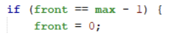 
Jawab : 
Potongan kode ``` if (front == max - 1) { front = 0; } ``` dalam method Dequeue bertujuan untuk mengatur ulang pointer front ke indeks awal array jika sudah mencapai batas maksimum array. Hal ini untuk kelancaran operasi penghapusan elemen dari antrian tanpa kehilangan data yang ada.

4. Pada method print, mengapa pada proses perulangan variabel i tidak dimulai dari 0 ```(int i=0)``` melainkan ```int i=front```?
Jawab : 
Pada method print, perulangan dimulai dari nilai front karena dalam antrian sirkular, posisi awal elemen bisa dimulai dari indeks selain 0 pada array. Dengan memulai dari front memastikan bahwa dapat menampilkan elemen-elemen antrian sesuai urutan dalam antrian sirkular, tanpa mengabaikan elemen yang mungkin telah dihapus dari depan antrian sebelumnya.

5. Perhatikan kembali method print, jelaskan maksud dari potongan kode berikut!
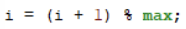 
Jawab : 
Potongan kode ``` i = (i + 1) % max; ``` bertujuan untuk mengatur ulang nilai variabel i agar perulangan dapat terus berlanjut melalui seluruh elemen dalam array yang mewakili antrian. Dengan menggunakan operasi modulus %, nilai i akan kembali ke 0 setelah mencapai indeks maksimum array max - 1, sehingga perulangan dapat melanjutkan dari awal array.

6. Tunjukkan potongan kode program yang merupakan queue overflow!
Jawab : 
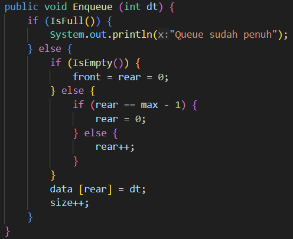 

7. Pada saat terjadi queue overflow dan queue underflow, program tersebut tetap dapat berjalan dan hanya menampilkan teks informasi. Lakukan modifikasi program sehingga pada saat terjadi queue overflow dan queue underflow, program dihentikan!
Jawab : 
- Modifikasi class Qeuue pada method enqueue dan dequeue : 
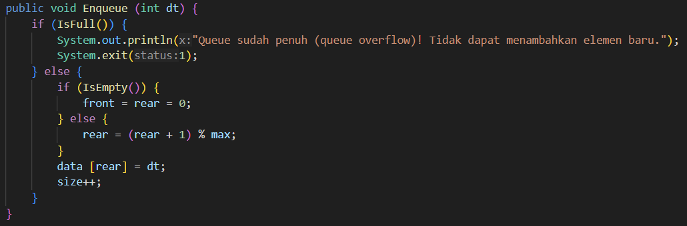 
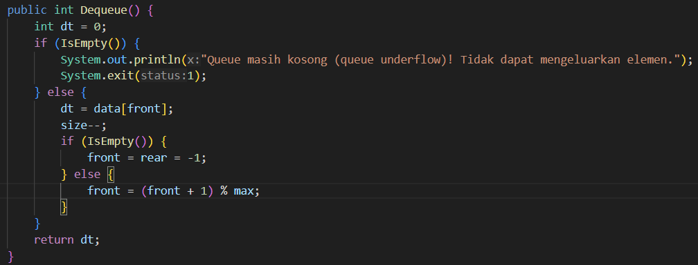 

- Modifikasi class QueueMain : 
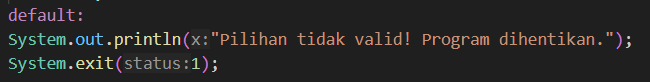 

- Output Overflow
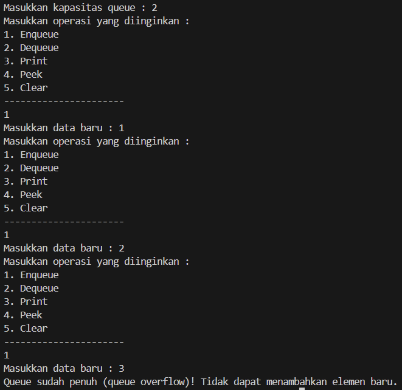 

- Output Underflow
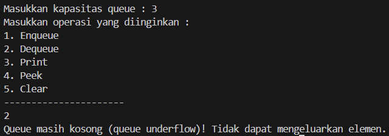 

## 10.2 Praktikum 2
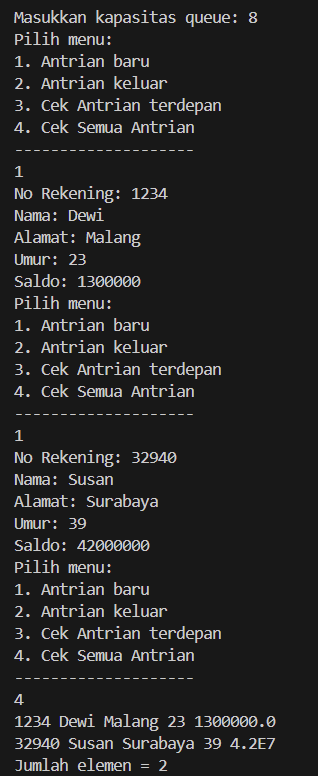

### 10.3.3 Pertanyaan
1. Pada class QueueMain, jelaskan fungsi IF pada potongan kode program berikut!
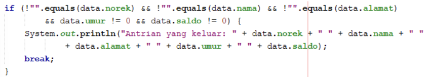
Jawab : 
Potongan kode tersebut berfungsi untuk memeriksa apakah objek data yang didequeue 
memiliki nilai yang valid untuk atribut norek, nama, alamat, umur, dan saldo. Dengan kondisi ``` !"".equals(data.norek) && !"".equals(data.nama) && !"".equals(data.alamat) && data.umur != 0 && data.saldo != 0 ```, program memastikan bahwa semua atribut tidak kosong atau tidak null, serta umur dan saldo memiliki nilai yang tidak sama dengan nol.

2. Lakukan modifikasi program dengan menambahkan method baru bernama peekRear pada class Queue yang digunakan untuk mengecek antrian yang berada di posisi belakang! Tambahkan pula daftar menu 5. Cek Antrian paling belakang pada class QueueMain sehingga method peekRear dapat dipanggil!
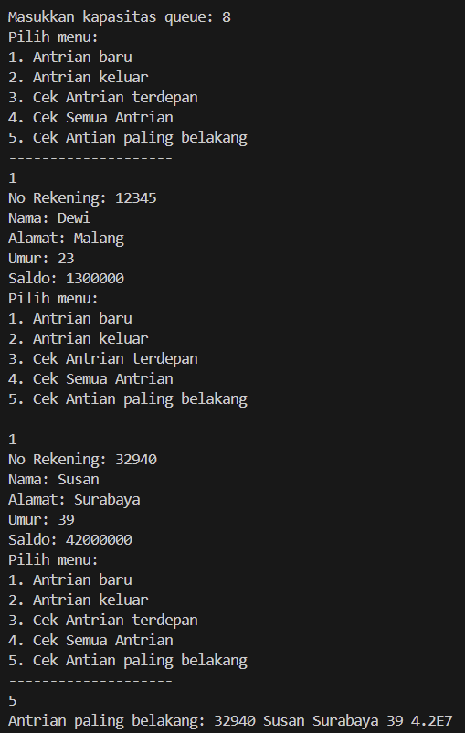
Jawab : 


## 10.3 Latihan Praktikum
1. Buatlah program antrian untuk mengilustasikan pesanan disebuah warung. Ketika seorang pembeli akan mengantri,maka dia harus mendaftarkan nama, dan nomor HP seperti yang digambarkan pada Class diagram berikut : 
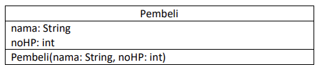
Class diagram Queue digambarkan sebagai berikut:
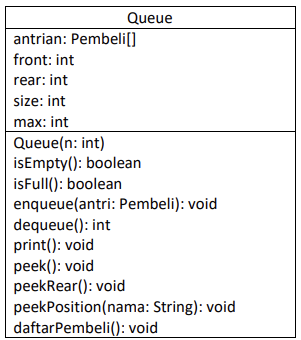
Keterangan :
- Method create(), isEmpty(), isFull(), enqueue(), dequeue() dan print(), kegunaannya sama seperti 
yang telah dibuat pada Praktikum
- Method peek(): digunakan untuk menampilkan data Pembeli yang berada di posisi antrian paling 
depan
- Method peekRear(): digunakan untuk menampilkan data Pembeli yang berada di posisi antrian 
paling belakang
- Method peekPosition(): digunakan untuk menampilkan seorang pembeli (berdasarkan nama)
posisi antrian ke berapa
- Method daftarPembeli(): digunakan untuk menampilkan data seluruh pembeli

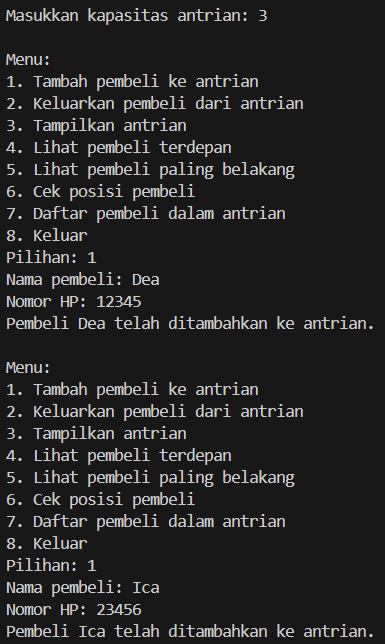
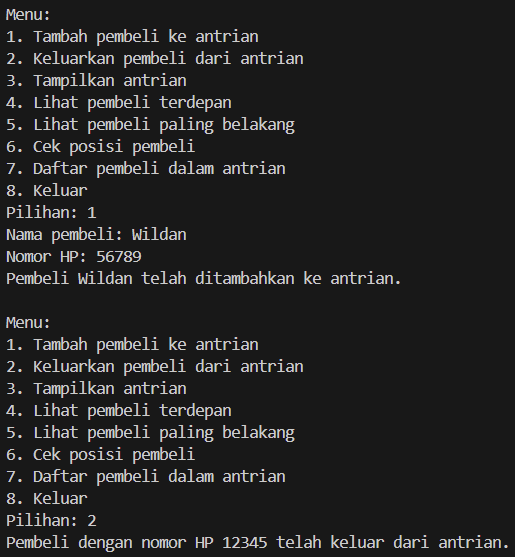
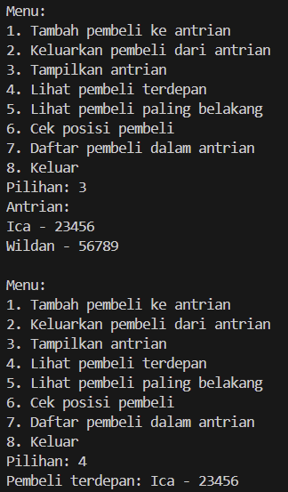
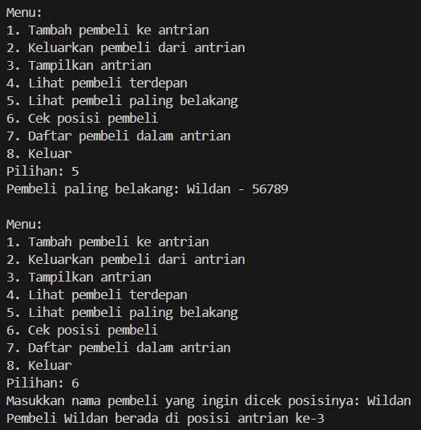
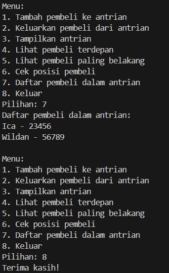